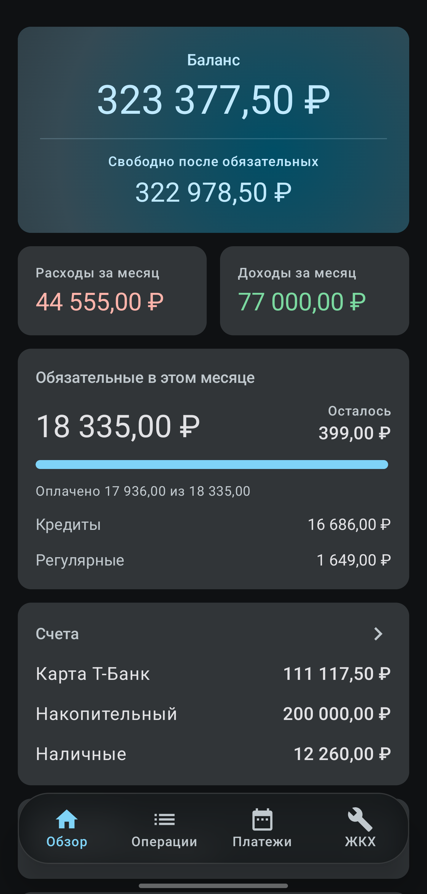
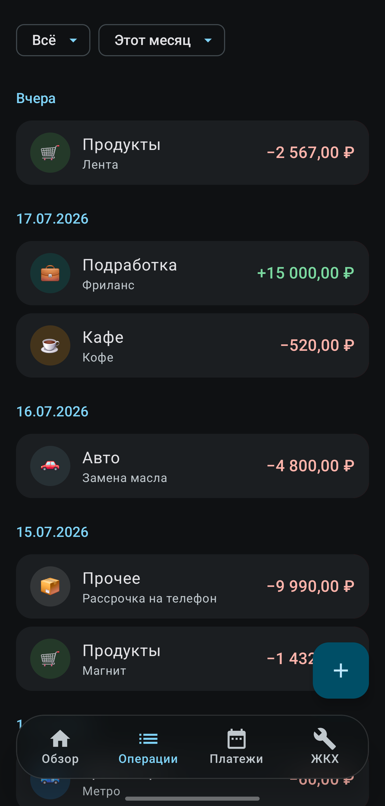
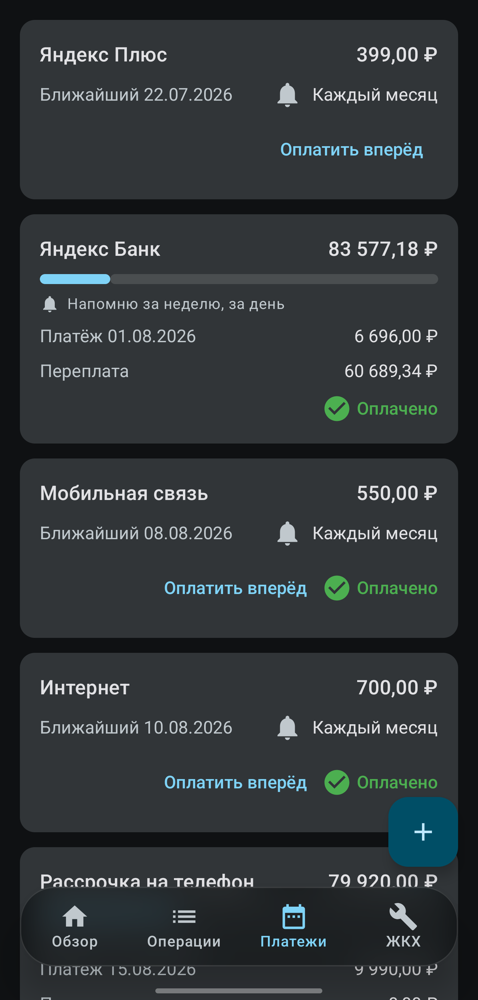
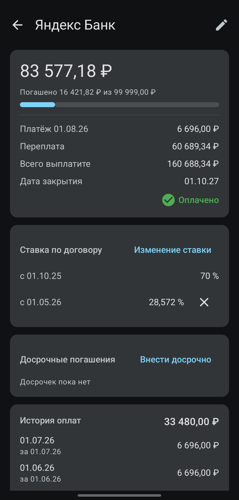
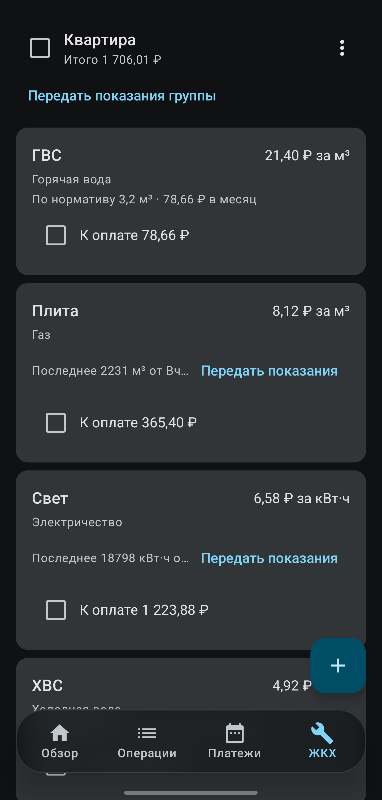
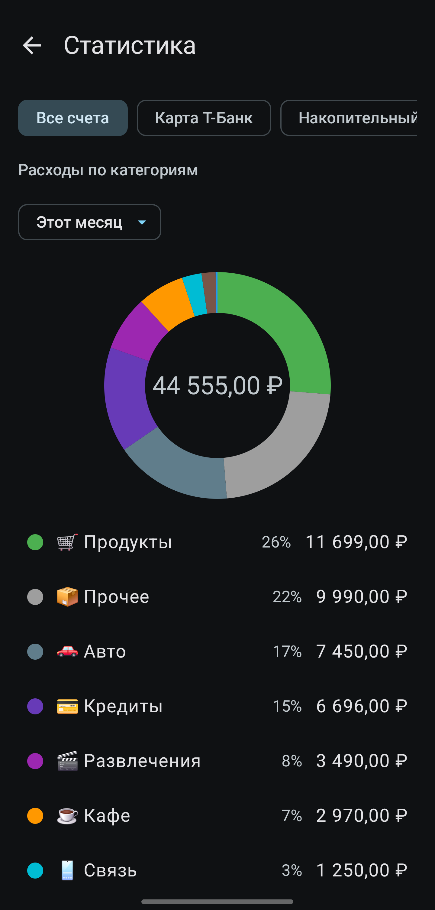
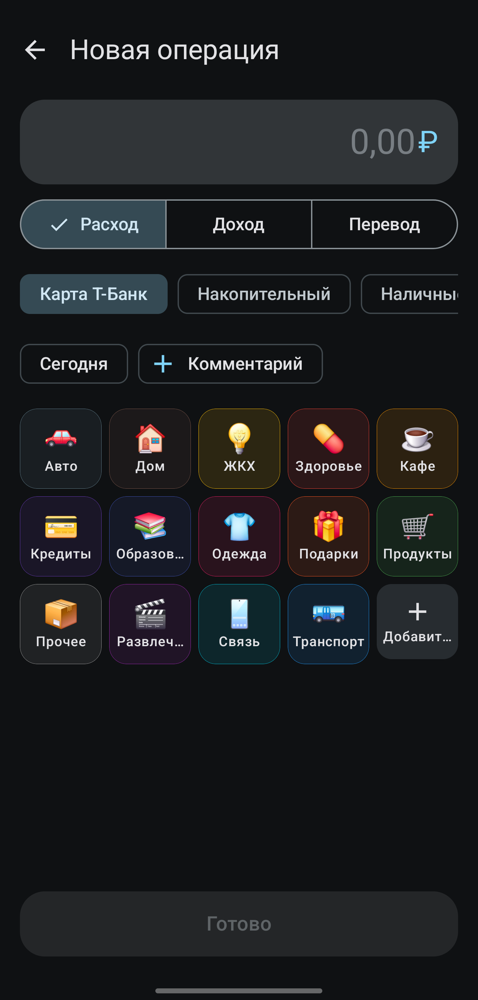
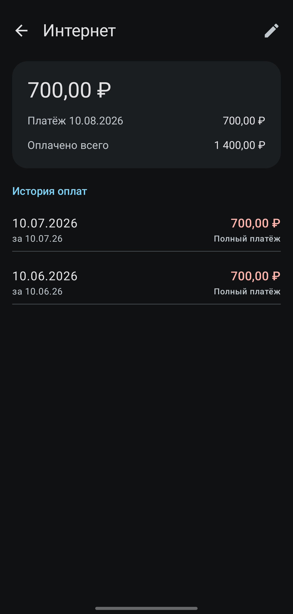
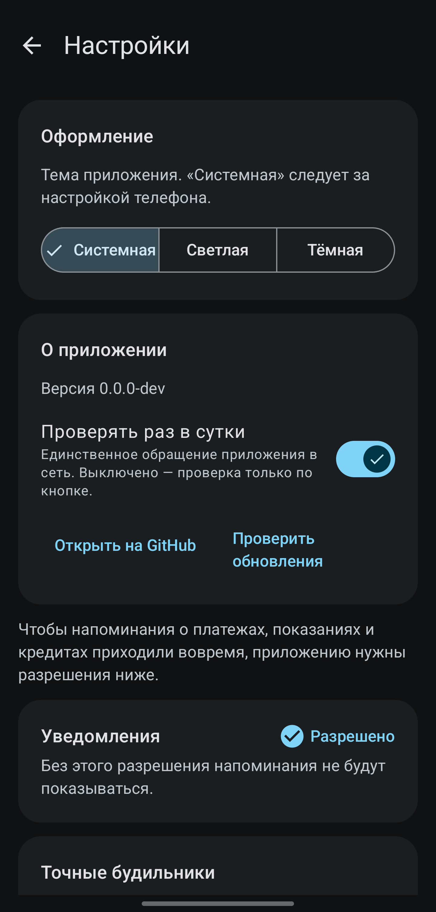

# FinTrack

Учёт личных финансов для Android: расходы и доходы, кредиты, коммунальные платежи.
Работает без сервера — все данные лежат на телефоне.

## Зачем

Приложения для учёта финансов обычно либо просят завести аккаунт, либо считают проценты
по кредиту приблизительно. FinTrack не делает ни того, ни другого:

- **Никакого сервера.** Нет регистрации, нет синхронизации, нечего утечь.
- **Деньги в копейках.** Все суммы — целые числа `Long`. Ни одного `Double` в расчётах.
- **Проценты как в банке.** Остаток × ставка / 365 (366 в високосный) × фактические дни
  периода, округление HALF_UP на каждом платеже. Формулы сверены с реальным договором
  до копейки.

## Как выглядит

| Обзор | Операции | Платежи |
|---|---|---|
|  |  |  |

| Кредит | ЖКХ | Статистика |
|---|---|---|
|  |  |  |

| Ввод операции | Регулярный платёж | Настройки |
|---|---|---|
|  |  |  |

Данные на скриншотах демонстрационные. Подробнее — в
[docs/screenshots](docs/screenshots/README.md).

## Возможности

**Операции.** Быстрый ввод в три касания, категории с иконками, свайп для правки и
удаления, статистика по категориям и месяцам.

**Кредиты.** Аннуитет, дифференцированный, рассрочка и «только проценты». График платежей
не хранится в базе, а генерируется чистой функцией — поэтому смена ставки или досрочное
погашение просто пересчитывают его целиком, и рассинхрону взяться неоткуда. Симулятор
досрочки сравнивает «сократить срок» и «уменьшить платёж».

**Обязательные платежи.** Подписки и регулярные счета вместе с кредитами одним списком.
Напоминания в день платежа, отметка «оплачено» создаёт реальную операцию — баланс
отражает то, что произошло, а не то, что запланировано.

**ЖКХ.** Счётчики с тарифами, ввод показаний с автоматическим расчётом, услуги по
нормативу и с фиксированной суммой. Группировка по квитанциям, ввод показаний пачкой и
оплата нескольких услуг разом. Прошлые показания хранят свой тариф, поэтому смена тарифа
не переписывает историю.

**Виджеты.** Баланс со свободными деньгами после обязательных платежей и список ближайших
платежей. Три размера, содержимое подстраивается.

## Установка

APK лежит в [релизах](https://github.com/Sch1z0eD/FinTrack/releases). Android спросит
разрешение на установку из этого источника.

Приложение умеет проверять обновления само: **Настройки → О приложении**. Проверка
выключена по умолчанию и делается только по кнопке, пока её не включат — это единственный
случай, когда приложение выходит в сеть.

## Сборка

Нужен JDK 21.

```bash
./gradlew assembleDebug        # собрать
./gradlew installDebug         # поставить на подключённый телефон
./gradlew :loanengine:test     # тесты кредитного движка
./gradlew lint :loanengine:test  # перед коммитом
```

Три варианта сборки — это три разных приложения, которые спокойно стоят на телефоне
одновременно и не мешают друг другу:

| вариант | приложение | откуда обновляется |
|---|---|---|
| `debug` | `com.findev.fintrack.debug` — «FinTrack dev» | никак, ставится из Android Studio |
| `beta` | `com.findev.fintrack.beta` — «FinTrack beta» | бета-релизы с GitHub |
| `release` | `com.findev.fintrack` — «FinTrack» | стабильные релизы |

Так сделано потому, что Android не даёт заменить приложение сборкой с другой подписью:
без разделения каждое переключение между отладкой и релизом означало бы переустановку и
потерю базы.

## Как устроено

```
:app          Compose UI, Room, Hilt, WorkManager, виджеты
:loanengine   кредитная математика — чистый Kotlin, без Android
```

Kotlin, Jetpack Compose, Material 3, Room, Hilt, WorkManager, Glance, Vico. minSdk 31.

Кредитный движок вынесен в отдельный модуль без единой зависимости от Android: график
платежей — это арифметика, её нужно уметь проверять юнит-тестами, а не на эмуляторе.
Эталоны в тестах посчитаны вручную по реальным договорам, а не сгенерированы этим же
движком — иначе тест проверял бы сам себя.

Экраны следуют MVVM: Screen → ViewModel → Repository → DAO. ViewModel ничего не знает о
Compose, Composable не ходят в репозитории.

## Релизы

Канал задаёт тег, а не ветка:

```bash
git tag v1.2.3      && git push origin v1.2.3       # стабильный релиз
git tag v1.2.4-beta && git push origin v1.2.4-beta  # prerelease, только бета-приложение
```

`versionCode` и `versionName` выводятся из тега, поэтому опубликованная сборка не может
разойтись со своим номером. Номера версий у каналов общие и просто растут дальше — беты
и стабильные версии никогда не встречаются, потому что это разные приложения.

Стабильное приложение читает `/releases/latest`, который по определению GitHub не
возвращает prerelease, — беты к нему не попадут даже случайно. Работа ведётся в ветке
`dev`, в `master` попадает то, что готово к релизу.

## Лицензия

MIT
